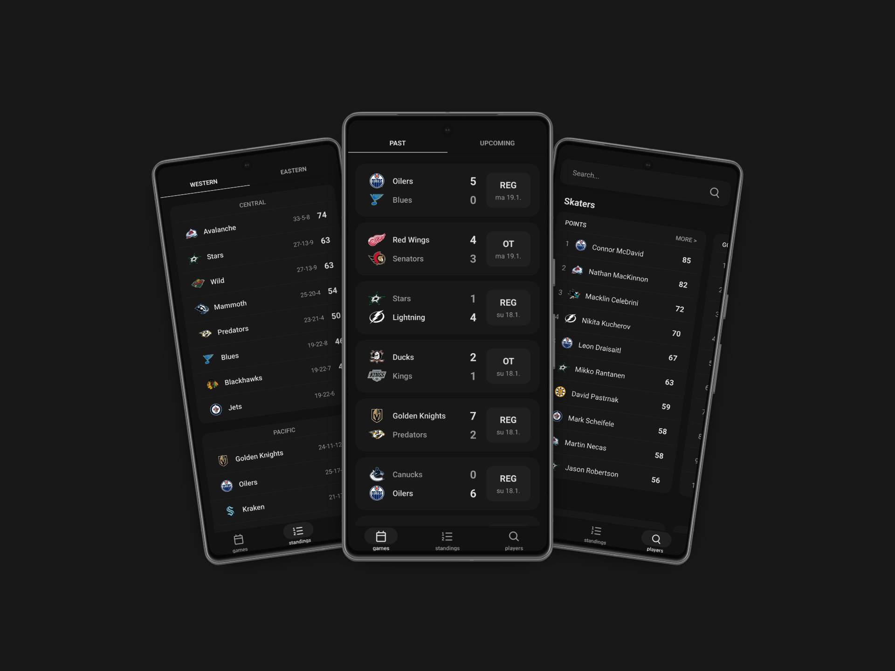

# WHENHL 

NHL's own mobile app lack features and is hard to use, so I made an easier way to reach basic data from NHL via mobile using their public API (Here's a detailed documentation for it: https://github.com/Zmalski/NHL-API-Reference)
<br>

## Features
- **Games** - Upcoming and past NHL games, scores and start times
- **Gamestory** - Scoring, shots and other information on played games
- **Standings** - Current league standings 
- **Team stats** - Team specific stats, roster and schedule
- **Players** - Player tops and search for specific player
- **Player stats** - Player specific stats
<br>


<br>

## Download
[Download apk here](https://github.com/okkonie/whenhl/releases)
<br>

## Tech Stack
- [Expo](https://expo.dev/) - React Native framework
- [Expo Router](https://docs.expo.dev/router/introduction/) - File-based routing
- [NHL API](https://api-web.nhle.com/) - Official NHL data
- [async storage](https://github.com/react-native-async-storage/async-storage) - Cache logos in local storage

## Installation
```bash
# clone the repo
git clone https://github.com/okkonie/whenhl.git

# Install dependencies
npm install

# Start the development server
npx expo start
```