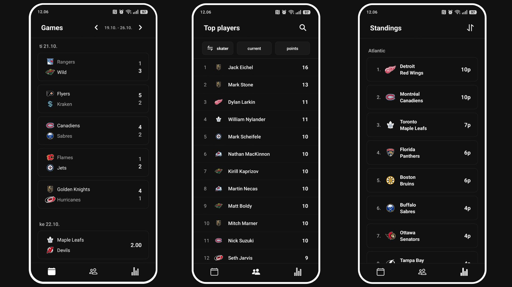

## WheNHL

A mobile app to follow NHL games, teams, and players in real-time.

## Features

- **Schedule** - View past results and upcoming games for all teams
- **Player Profiles** - Access player stats, career totals, and more
- **Team Statistics** - View detailed team stats, standings, and recent performance
- **Game Details** - See scoring summaries, team leaders, and matchup information

<br>


- **React Native** with Expo
- **Expo Router** for navigation
- **NHL API** for live data

## Installation

```bash
# Clone the repository
git clone https://github.com/okkonie/whenhl.git

# Install dependencies
npm install

# Start the development server
npx expo start

# or android
npx expo run:android

# or iOS
npx expo run:ios
```

## Build

```bash
# Build for Android
eas build --platform android

# Build for iOS
eas build --platform ios
```

## Project Structure

```
whenhl/
├── app/              # Main app screens and navigation
│   ├── index.jsx     # Home screen with live games
│   ├── teams.jsx     # Teams list and standings
│   └── players.jsx   # Players list and search
├── components/       # Reusable UI components
│   ├── game.jsx
│   ├── gameModal.jsx
│   ├── playerModal.jsx
│   ├── TeamModal.jsx
│   └── modal.jsx     # Base modal component
└── assets/          # Images and fonts
```
<br>

## TODO

- [ ] A feature to let user predict game outcomes
- [ ] Implement favorites/bookmarks for teams and players
- [ ] Add playoff bracket
